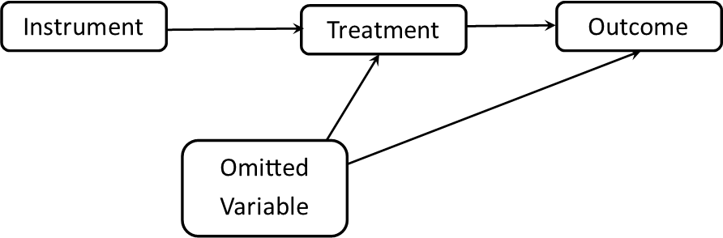

<style>
.column-left{
  float: left;
  width: 50%;
  text-align: left;
}
.column-right{
  float: right;
  width: 50%;
  text-align: right;
}
</style>

```{r setup, include=FALSE}
knitr::opts_chunk$set(echo = F)
library(knitr)
```

<div class="column-left">
Do women govern better than men? Can corrupt politicians influence local media to get re-elected? How do authoritarian regimes survive during economic crises?

This is an applied course in how to *explain* the outcomes – public policies, democracy, peace, governance, corruption, inequality – we study in political science. It provides students with the skills, tools and confidence to implement a wide range of analyses commonly used in leading political science studies. 

This course is the third course in a three course sequence, following Quantitative Methods I (Introductory Statistics) and Quantitative Methods II (Multivariate Regression).
</div>


<div class="column-right">
```{r, fig.width=4}

```
</div>


